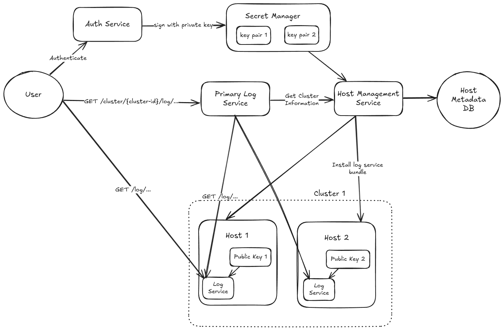

## Tenets
- Secured
- Lightweight and undiscruptive on the host machine
- Speed

## Requirements
- RESTful API to get logs from a log file under `/var/log`
- User authentication
- Support arbitrarily large log file by pagination
- Support log filtering

## High Level Design


Source: https://excalidraw.com/#json=ovZ0Jt9Jf_X9HAmVxEt-t,C6OpliBHiDWInO6J0CaHaw

### Authentication flow
Authentication is implemented using public/private key infrastructure. During log service installation, Host Management Service (HMS) installs the log service along with the public key.

The user uses Auth Service (AS) to authenticate. Upon successful authentication, AS returns to the user an authentication token signed by the private key--corresponding to the public key stored in the host.

The log service can verify the authentication token using the public key.

What if the public/private key is compromised?
- We can limit the impact radius by partitioning hosts into ranges, and assigning each range a public/private key pair.

**Note:** very similar to JWT

### Get logs from a single host
Log service exposes a HTTP API that takes a log file path as a required parameter.

Because we require to support arbitrarily large log file, the API allows an optional parameter to specify how many lines to returns from the log. If not specified, the default value to take is 5000 lines. We need to limit the value of this parameter between [1-5000]. The upper limit is important to avoid timing out and taking too much resource from the host.

The return payload includes the logs and the pointer to the next page. The pointer is simply the position in the log file.

### Get logs from primary log service
This flow retrieves logs from a cluster of hosts. Because clusters vary in sizes, how we handle pagination is different from a single host.

I proposed that the primary log service (PLS) maintains an short-term mapping (e.g. Redis) between an opaque string to the next pointer of each hosts. The primamry log service could use the mapping to retrieve the next page from each host.

When the user requests logs from a cluster, the PLS retrives the cluster's data from the HMS. The most important piece is the host's URL. After that, the PLS can constructs asynchronous HTTP requests for each host to get logs.

For future development, HMS could also keep track of host's status (i.e. up/down) to avoid unnnessary requests to rotated hosts.

## API Specification
### Host API
GET `/logs/{path}`

Parameters
- `take` the number of lines from the file
  - type: bounded integer between [1-1000]
  - default: 1000
- `ptr` the next page pointer
  - type: long
- `contains` keyword to match
  - type: string

Response
```
{
  logs: [<string>],
  nextPtr: <string> 
}
```

### Primary API
GET `/cluster/{cluster-id}/logs/{path}`

Parameters
- `take` the number of lines from the file
  - type: bounded integer between [1-1000]
  - default: 1000
- `ptr` the next page pointer
  - type: string
- `contains` keyword to match
  - type: string

Response
```
{
  hosts: [
    {
      hostName: <string>,
      logs: [<string>]
    }
  ]
  nextPtr: <string> 
}
```

# Lower level design

The log file is chunked using random pointer access. The starting and ending pointers are snapped into the newline character to ensure that chunks contain complete lines.

The API is multi-threaded. One thread handles file chunking and produces chunk objects (i.e. contains just the start/end pointer) into a queue. Multiple threads pull from the queue to process lines in each chunks.

To ensure that the output is inorder and not missing--due to the effect of `take` parameter, that a later chunk could take place of the newer ones. Chunks contain ordering information. The main thread is verifying that chunks are processed and output inorder.

The main thread keeps track of the number of lines processed so far, in order to terminate early accoridng to `take` parameter. Thus, the less the `take` value, the faster the response time of the API.

# Questions
What files do we allow access in `/var/log`?
- All files under `/var/log`

How do the user know what files are available in `/var/log`?

Do we allow sub-directory traversal under `/var/log`
- Yes

Is the primary/secondary server requirement for a common log file?